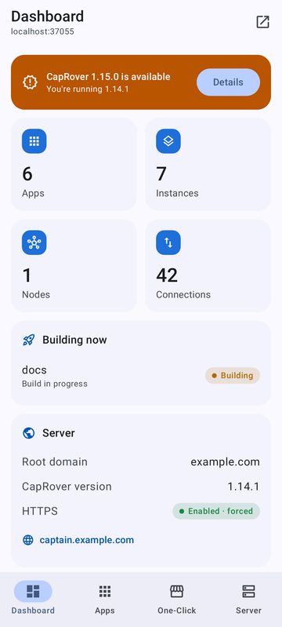
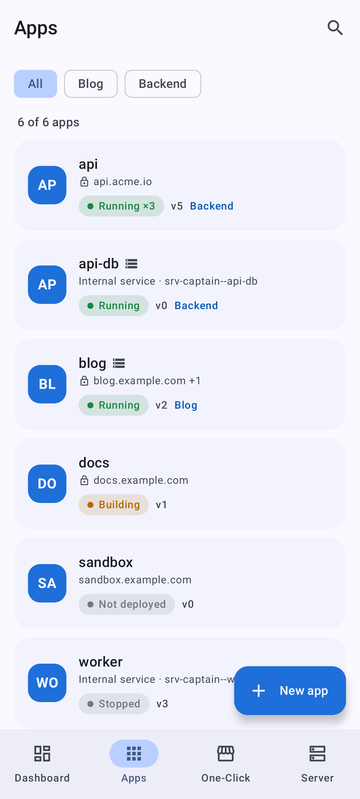
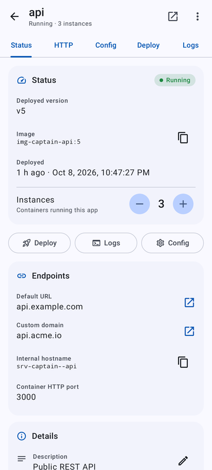
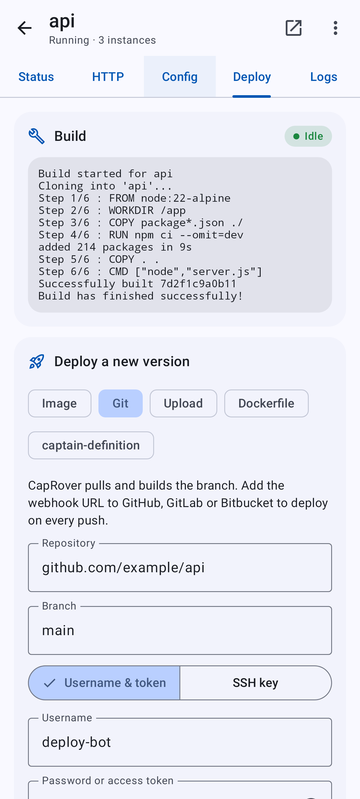
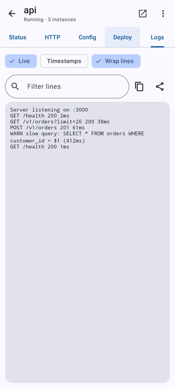
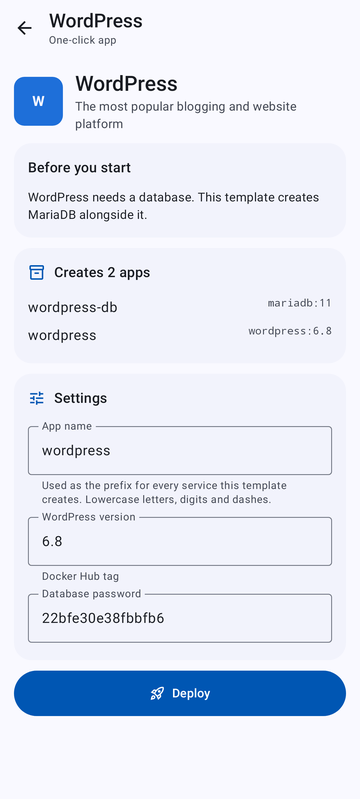

# CaproverForge

A native Android app for managing a [CapRover](https://caprover.com) server, built with Kotlin, Jetpack Compose and Material 3.
It talks to the same REST API (`/api/v2`) as the CapRover web dashboard, so it works with any CapRover server.

| Dashboard | Apps | App status | Deploy | Logs | One-click |
|---|---|---|---|---|---|
|  |  |  |  |  |  |

## Features

- **Sign in** with your dashboard password (plus a two-factor code if enabled). Only the session token is kept, encrypted with an Android Keystore key. The password is never stored.
- **Dashboard**: app and instance counts, server health (CPU, memory and disk from NetData), cluster nodes, live NGINX connections, HTTPS status, builds in progress, recent deployments, and update notices.
- **Server stats**: live CPU, memory, network, load average and disk charts from CapRover's built-in NetData, over 5 min, 1 h, 6 h or 24 h. Touch and drag a chart to read past values.
- **Apps**: search, filter by project, see status at a glance (running, building, stopped, not deployed, last build failed), and create new apps.
- **App details**
  - *Status*: deployed version and image, scale instances up and down, endpoints, description, project and tags.
  - *HTTP*: default and custom domains, enable Let's Encrypt HTTPS, force HTTPS, WebSockets, container port, redirect domain, HTTP basic auth, and a custom NGINX config editor.
  - *Config*: environment variables (list editor or bulk `KEY=value` text), port mappings, persistent directories (volumes or host paths), node placement, service update override, and pre-deploy script.
  - *Deploy*: live build logs; deploy from a Docker image, a Git repository (webhook URL and "build now"), a tarball upload, a Dockerfile or a `captain-definition`; app deploy tokens; version history with rollback.
  - *Logs*: live container logs with filter, timestamps, line wrap, copy and share.
  - Restart, rename, or delete (optionally with its volumes).
- **One-click apps**: browse and search the template catalogue, fill in the template variables (with validation and generated secrets), deploy, and follow progress step by step. Template repositories can be added and removed.
- **Server**: cluster nodes (and adding nodes), root domain and HTTPS, NGINX base and dashboard config, Docker registries (including the self-hosted registry), disk cleanup (unused images and an automatic schedule), projects, NetData monitoring, CapRover updates, backups, and changing the password.
- Light and dark themes, plus optional Material You wallpaper colours.

Settings changes are collected into a draft and applied with one **Save & restart**, the same as the web dashboard.

## Server stats and NetData

CapRover serves NetData at `/net-data-monitor/` and only accepts the `captainCookieAuth` cookie it sets at sign-in, not the API token. The app keeps that cookie (encrypted, like the token). If you signed in with an earlier version of the app, sign out and back in once to see stats. Turn NetData on under **Server → Monitoring**.

## Requirements

- Android 8.0 (API 26) or newer. Built against **Android 17 (API 37)** (`compileSdk` and `targetSdk` 37).
- A CapRover server. One-click deployments from the app need a CapRover version that deploys templates server-side (`/user/oneclick/deploy`).

## Download

Every commit to `main` publishes a new release on the [Releases page](../../releases/latest), named `CaproverForge 2.1.<build>`:
- `CaproverForge-2.1.<build>-debug.apk`: install this one. Every release is signed with the same key, so a new one installs over the old one and keeps your sign-in.
- `CaproverForge-2.1.<build>.apk`: a minified release build, published only when a release signing key is configured (see below).

Pull requests build the same APKs as workflow artifacts in the [Actions tab](../../actions), along with `ui-screenshots`, but don't publish a release.

### Signing release builds (optional)

The debug APKs are signed with `app/debug.keystore`. That key is committed on purpose: it's a throwaway key, like the debug key Android Studio generates, and keeping it fixed is what lets each release install over the previous one. To also publish a release build signed with your own key, add these repository secrets (Settings → Secrets and variables → Actions):

| Secret | Value |
|---|---|
| `RELEASE_KEYSTORE_BASE64` | `base64 -w0 my-release.jks` |
| `RELEASE_STORE_PASSWORD` | keystore password |
| `RELEASE_KEY_ALIAS` | key alias |
| `RELEASE_KEY_PASSWORD` | key password |

Keep a backup of that keystore: Android only accepts updates signed with the same key.

## Building locally

Requires JDK 21 (JDK 17 builds the app, but the Robolectric tests need 21) and an Android SDK with `platforms;android-37.0` and `build-tools;37.0.0` (point `sdk.dir` in `local.properties`, or `ANDROID_HOME`, at it).

```bash
./gradlew assembleDebug          # debug APK
./gradlew assembleRelease        # minified release APK (unsigned unless RELEASE_KEYSTORE is set)
./gradlew testDebugUnitTest      # unit, API and UI flow tests (Robolectric, no device needed)
./gradlew recordRoborazziDebug   # same tests, also writes screenshots to app/screenshots/
./gradlew lintDebug
```

Toolchain: Android Gradle Plugin 9.4.1, Gradle 9.6.0, Kotlin 2.4.20, Compose BOM 2026.09.00.

Dependencies are fetched from Google's mirror of Maven Central (`maven-central.storage-download.googleapis.com`) first, with Maven Central as the fallback. That avoids Central's rate limits (HTTP 429), which shared CI runners hit. Robolectric downloads its Android runtime from the same mirror.

## How it's built

- `data/`: `CapRoverApi` (OkHttp client: response envelope, error codes, session expiry), `CapRoverRepository` (one method per dashboard operation), models that mirror the official `caprover-api` client, and helpers (Docker log decoding, one-click template variables, env-var parsing).
- `ui/`: one package per area (`dashboard`, `apps`, `appdetail`, `oneclick`, `server`), plus shared components and theme.
- Tests run the real app against `FakeCapRover`, a MockWebServer that speaks CapRover's API, so sign-in, navigation, editing and saving are exercised end to end without a real server.
